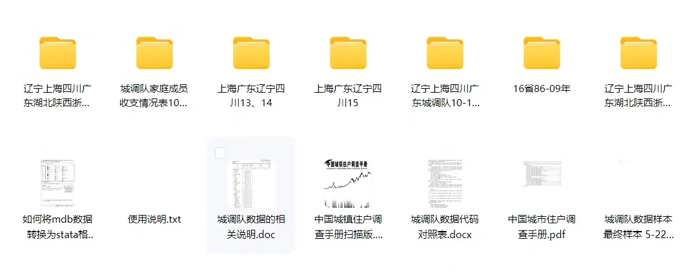
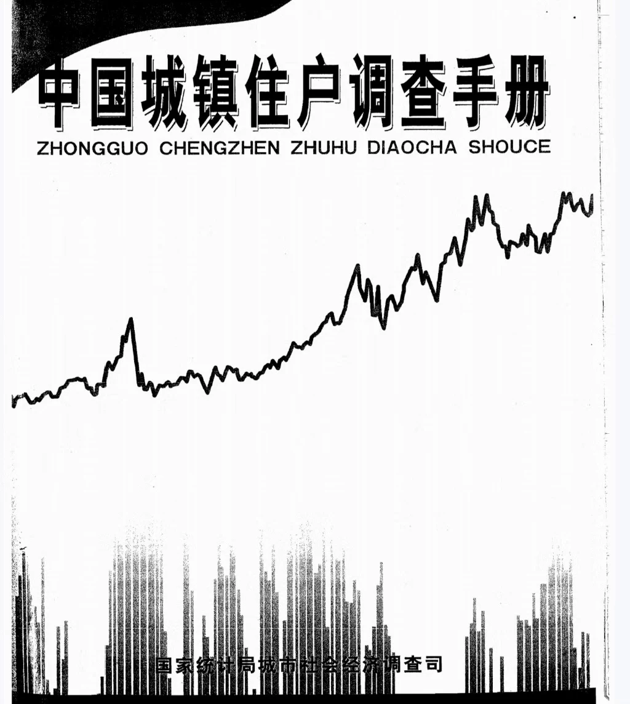

## Body

UHS (Urban Household Survey) is a micro-level survey of urban households in China. The data from this survey covers the period from 1986 to 2015.

## Images

item_1072569912591

Here is a pay link on Stripe ( https://buy.stripe.com/3cs8yP7sY87d0vu9AB ). Please contact me lonlonago@foxmail.com after funding $89, and I will send you a complete data files , thank you!

